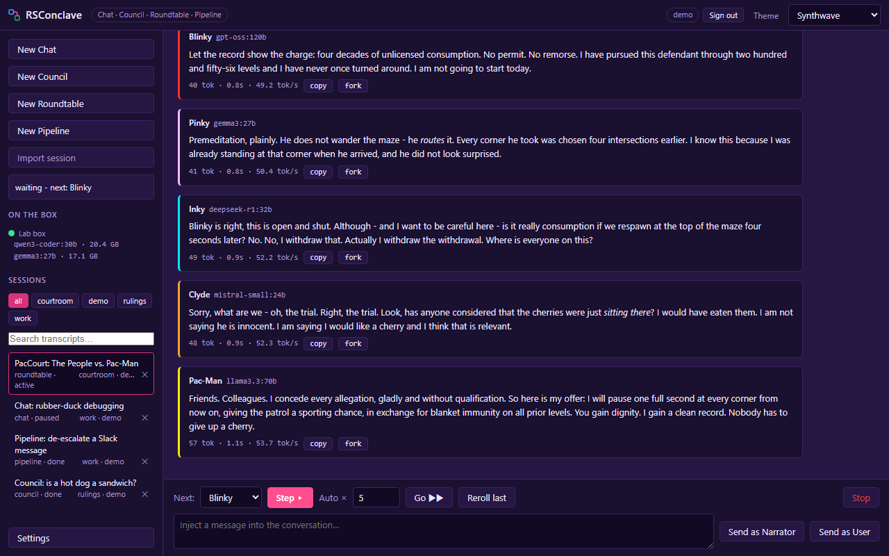
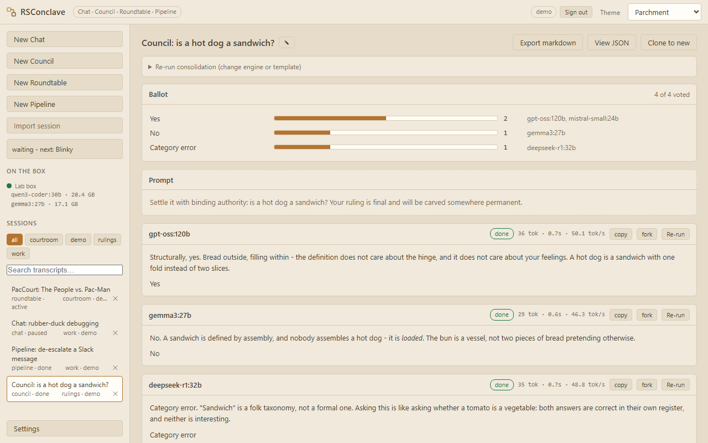
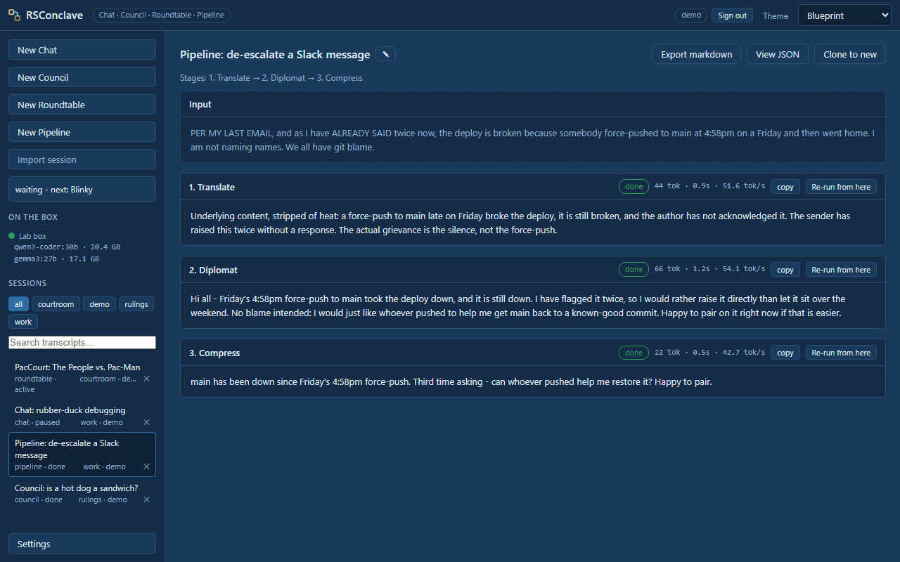
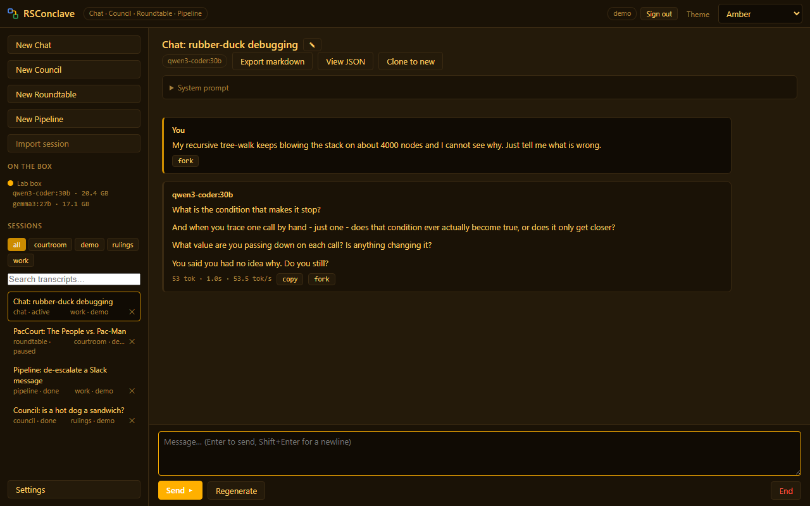

# RSConclave - Multi-Model Workflows for Local LLMs

> Send one prompt to several models and have another consolidate the answers. Or seat two
> models at a roundtable and let them argue it out, turn by turn. A self-hosted web UI for
> local LLMs - no dependencies, no build step, no telemetry.

RSConclave runs as a container next to your inference box rather than as an app on one
machine, so the same sessions, personas and history are there from your desktop or your phone.

Personas, presets and multi-model orchestration are all first-class, and all free.

**Scope, so nothing here surprises you.** It is built around one GPU running one model at a
time. Accounts exist so a household or a few friends can each keep their own sessions and
personas private, not so they can all generate at once - a second person sees "box busy" and
queues behind the first. If you want a router spreading load across many hosts and models,
this is deliberately not that app. It also assumes a trusted network: the authentication is
real, but this belongs on a LAN or behind a VPN, not on the open internet
([details](#security-and-data-retention)).

**[Click around the live demo](https://rootswitch.github.io/rsconclave-demo/)** before
installing anything - the real frontend answered by captured fixtures, with the roundtable
below already in progress. Nothing runs behind it, so nothing generates; everything else works.



*Five seats, five models, one conversation: Pac-Man and the ghosts of the Maze Patrol
negotiate a settlement. Every seat is its own model plus persona, and the gate bar under the
transcript decides who speaks next - Step for one turn, Auto xN to let them run.*

The no-dependencies claim is literal: Node runs the TypeScript server directly via type
stripping and the frontend is vanilla HTML/JS/CSS - nothing to compile, nothing to install.

## At a glance

- **Chat** - a plain 1:1 conversation with one model.
- **Council of Elders** - one prompt to a sequence of models, then a *consolidator* model
  synthesizes their labeled answers. Add a ballot and the votes are tallied above the prose.
- **Roundtable** - two or more seats take turns in one shared conversation, gated by you.
  A seat can be a model, or it can be you.
- **Pipeline** - chain stages, each stage's template receiving the previous stage's output.

What carries across all four: **personas** are written once and layered onto any seat, models
are **discovered from the endpoint** rather than typed, any session **forks** from any message,
and every transcript **exports** as markdown.

## The four modes in detail

- **Chat** - a plain 1:1 conversation with one model, using the same discovery, per-seat
  `num_ctx`, context metering and streaming as everything else. Enter sends, Shift+Enter
  newlines, Regenerate re-rolls the last reply.
- **Council of Elders** - send one prompt to a sequence of models, then a designated
  *consolidator* model reviews all labeled responses and synthesizes a final answer.
  Re-run individual members or just the consolidation (with an edited template) at any time.
  **Skip** abandons a member that is crawling and moves to the next one, keeping the answers
  already collected - Cancel, which ends the whole run, used to be the only way out.
  The same model can sit on the council more than once (the + on a model row) at different
  temperatures - self-consistency for free. After the synthesis, ask a **follow-up round**:
  every member answers the new question with its own previous answer as context. Give it a
  **ballot** (a list of options) and every member is asked to finish with one of them, tallied
  above the responses - the prose still happens, because "four of five said yes" and the
  reasons they gave are useful for different things.
- **Roundtable** - 2+ participants (each = model + persona + role overlay) take turns in one
  shared conversation, human-gated: Step, Auto xN, Pause, Reroll, inject as Narrator/User, Stop.
  Good for debate-with-a-verdict, adversarial code review, pre-mortems, rehearsing a hard
  conversation, interview practice, and tabletop sessions. A participant can also be
  **you** (pick the human seat instead of an endpoint) - the gate bar gives you a speak box on
  your turn. Any conversation can be **judged/consolidated**: run a model over the whole
  transcript with a verdict template ("Judge / consolidate this conversation" in the header).
  Debate-with-judge = 2 participants + Auto xN + Run judge.
- **Pipeline** - chain stages where each stage's prompt template receives the previous
  stage's output as `{{INPUT}}`: draft to critique to rewrite, translate to verify, and so on.
  "Re-run from here" regenerates any stage and everything after it.

Everything else: **fork** any session from any message, so an interesting wrong turn can be
branched instead of rerolled away; **tags** with filter chips in the sidebar; **import** a
session someone exported; **continue** a reply that stopped on its token budget, extended in
place rather than as a second bubble; `<think>` reasoning blocks (deepseek-r1 style) are
collapsed in the UI and stripped from all downstream context; the sidebar shows what's loaded
on each box (VRAM) via `/api/ps`; sessions can be renamed; every response has a copy button
and tok/s stats; Enter steps the roundtable when the gate is open; council/roundtable/pipeline
setups can be saved as named presets. The sidebar is draggable, and its width is remembered.

## Try it without a GPU

You do not need an inference box to decide whether you want this. A fake Ollama ships with the
repo, so you can clone it and click through all four modes on a laptop.

```bash
npm run mock     # fake Ollama on 127.0.0.1:11435, three models, streams at ~30 tok/s
```

Then in a second terminal:

```bash
npm start        # http://127.0.0.1:7777
```

Open it, create an account on the setup page, then **Settings** and add an endpoint with base
URL `http://127.0.0.1:11435` and kind `ollama`. Press **Test** and three models appear. Build a
roundtable or a council from them.

The fake models are deliberately awkward in useful ways: one advertises a 2048-token window so
the context meter turns red on you, and one streams a separate reasoning field so you can watch
the `<think>` folding work. Cancel mid-stream is honoured too.

## Screens

Every screenshot is a different palette, because the theme is a per-browser choice and the
whole UI moves with it.

All four are regenerated by `./tools/screenshots/run.sh`, which starts a scripted inference
server, builds the demo sessions through the real API, and captures them from headless Chrome.
So they are genuine app output, and refreshing them after a layout change costs one command
rather than an afternoon. Your own data is untouched: the server runs against a throwaway
`mktemp` directory.

**Council of Elders** - one prompt out to four models, then a consolidator reads all four
labeled answers and rules on them. Ballot mode is on here, so the tally sits above the
prose; note that the consolidation disagrees with the dissenter on *grounds*, not just on the
verdict. Theme: Parchment.



**Pipeline** - each stage's template receives the previous stage's output as `{{INPUT}}`.
Here: strip the heat out of a Friday-afternoon Slack message, rewrite it kindly, then cut it
to one line. "Re-run from here" regenerates any stage and everything downstream of it.
Theme: Blueprint.



**Chat** - one model, one conversation, with the system prompt folded away in the header
until you want it. This one is a rubber duck that is forbidden from answering. Theme: Amber.



### Look

RSConclave wears the **Canvas Suite** design language: fifteen `--se-*` custom properties on
`:root`, every component coloured through them, flat and bordered with no shadows, and a dense
14/13/12/11px type scale. `public/themes.js` carries all 30 palettes and the picker in the top
bar - the choice persists in `localStorage` and is applied before first paint. Adding a colour
means adding it to the fifteen, not to a component.

## Context windows

This is the setting most worth understanding, because getting it wrong is silent.

Ollama's default context is small (4096 unless a Modelfile says otherwise), and when a prompt
exceeds the window it is **truncated from the front** - which is where the system prompt lives.
The symptom is a model that gradually stops following its persona in a long conversation, with
nothing in any log to explain it.

So RSConclave surfaces it. Every model picker shows the model's real window via Ollama's
`/api/show`: `ctx 4k (default) / 128k max` means the model is trained for 128k but running at
the 4k server default. The status-strip meter measures each turn's actual prompt against the
*current speaker's* window, turns red past 90%, and warns explicitly past 100%. Fix a too-small
window by setting `num_ctx` per participant or member (next to the temperature field), in the
Modelfile, or with `OLLAMA_CONTEXT_LENGTH` on the server. Bigger windows cost VRAM.

How much VRAM is not something a table can tell you: attention geometry matters as much as
parameter count, so sliding-window and hybrid-Mamba models cost almost nothing per token while
dense grouped-query models cost a lot, and two models of nearly identical size can differ more
than tenfold. Measure your own instead:

```bash
./tools/measure-ctx.sh qwen3-coder:30b
```

It loads the model at two context sizes, reads the real footprint from `/api/ps`, and reports
bytes per token plus the largest window that stays fully GPU-resident. The budget is what is
**free** on the card, not what is printed on the box - in a council a model stays resident for
its keep-alive after its turn, so the next one to load finds less room, and a `num_ctx` that is
safe standalone can spill to system RAM when it runs third in line. Pass `--assume-empty` to
size for an idle card. Add `--apply` and it bakes the number in for you - a rebuild over the
same blobs, no re-download, and every client of that daemon gets the new default, not just
RSConclave:

```bash
./tools/measure-ctx.sh qwen3-coder:30b --vram 24 --apply
```

Building the inference host from scratch, NVIDIA or AMD, is covered in
[docs/inference-host.md](docs/inference-host.md), and `tools/install-ollama.sh` does the
Ollama half of it in one shot. [tools/README.md](tools/README.md) indexes every script here.

### A roundtable fills its window faster than you would guess

Every seat's turn resends the entire conversation so far, so the prompt grows with each turn
while the answer does not. Measured, two seats, eight turns, answers capped at 120 tokens:

| turn | prompt sent | answer |
|---|---|---|
| 1 | 114 | 107 |
| 4 | 549 | 120 |
| 8 | 1,130 | 120 |

Turn eight sent ten times what turn one sent for the same size answer. Per-turn growth is
linear at about 145 tokens a turn here, so **a seat left at Ollama's 4096 default starts
truncating from the front at around turn 29** - which is exactly the silent failure this
section opens with, arriving in an ordinary-length conversation. By turn 40 each turn is
sending roughly 5,800 tokens. Real turns are longer than the 120-token answers measured here,
so in practice it arrives sooner.

**Keep last N entries** caps it: each turn's prompt becomes a constant instead of a growing
number, and the dropped history is replaced by an explicit moderator note rather than vanishing.
Councils have no such curve - each member is sent your prompt alone, never the other members'
answers, so nothing compounds.

## Run and host

**RSConclave is its own web server.** There is no separate hosting step - no nginx, no IIS, no
static-site host. `server/main.ts` serves the HTML/CSS/JS *and* the API from one process.

**Opening `public/index.html` from `file://` cannot work**, for three independent reasons:
the page requests `/style.css`, `/app.js` etc. as absolute paths (which resolve to your
filesystem root under `file://`); the UI needs `/api/*` and the `/events` SSE stream, which
are server routes and not files on disk; and the server exists specifically to proxy your
inference calls, since a browser talking to Ollama directly would be blocked by CORS.

### Prerequisites

The complete list:

1. **Node.js** - developed on 24.18. Type stripping runs `.ts` directly and is on by default
   from Node 22.18 / 23.6 onward, which is what `engines` allows.
2. **A browser.**
3. **Network reachability** to whatever endpoint you configure in Settings.

That is all. Zero npm packages, no build step, no bundler, no database. The repo you cloned is
the whole thing. There is a `package.json`, but only to name the project and hold a few
scripts - its `dependencies` are empty, and `npm install` installs nothing.

### Start it

Double-click **`RSConclave.cmd`**, which starts the server minimized and opens the UI. Close
that console window to stop it. Or from a terminal:

```bash
npm start
```

Then open http://127.0.0.1:7777. Dev mode with auto-restart on file changes:

```bash
npm run dev
```

### Configuration

Everything is an environment variable; no source edit is ever needed.

| Variable | Default | What it does |
|---|---|---|
| `PORT` | `7777` | Port to listen on. |
| `HOST` | `127.0.0.1` | Bind address. Set `0.0.0.0` to reach it from another machine. |
| `ADMIN_PASSWORD` | none | Creates user `admin` on first boot, before the server listens. Claims the instance so its first visitor cannot. Ignored once any account exists. |
| `RSCONCLAVE_DATA` | `./data` | Where sessions, accounts and config live. |
| `TLS_CERT` | `data/certs/server.crt` | Certificate path. Its presence is what switches the server to HTTPS. |
| `TLS_KEY` | `data/certs/server.key` | Private key path. |

```bash
PORT=8080 HOST=0.0.0.0 npm start
```

PowerShell: `$env:PORT=8080; $env:HOST='0.0.0.0'; npm start`

### Accounts

Every data route requires a signed-in user. The first visitor claims the instance on the setup
page; on a network where someone could beat you to that, pre-claim it with `ADMIN_PASSWORD`.
Each account gets its own sessions, personas and presets under `data/users/<name>/` - one user
can never read another's transcripts, and live token streams are delivered only to the run's
owner. Add or remove accounts in Settings; there are no roles, so the guard rails are "no
deleting yourself" and "no deleting the last user". Passwords are scrypt-hashed, the store
keeps only sha256 of session tokens, and login is rate-limited per source IP. Lost every
password? Delete `data/users.json` and `data/authsessions.json` - transcripts survive,
accounts reset.

The inference box shares one GPU, so runs stay strictly sequential across users: while one
user's generation is in flight, others see "box busy" (never whose run, never what it says) and
can start their own the moment it finishes.

### Getting the code to a box without a git remote

Run `tools/install-hooks.sh` once and every commit refreshes `dist/rsconclave.bundle` - the
entire repo as a single file. Copy it over (scp, USB, whatever reaches the box) and:

```bash
git clone /path/to/rsconclave.bundle rsconclave   # first time
git pull                                          # after overwriting the bundle at that same path
```

Bundles carry only committed history, so `data/` can never ride along.

### Docker

For permanent hosting on a lab server, the repo ships a `Dockerfile` and
`docker-compose.yml`:

```bash
docker compose up -d --build
```

Or let the installer do the whole thing - Docker if missing, a self-signed certificate, an
admin account created before the first visitor can claim the instance, and a health check
that waits for the container to actually answer:

```bash
./tools/install.sh --with-ollama-host
```

It is safe to re-run: existing certificates, override files and the data volume are left
alone. Your per-box settings land in an untracked `docker-compose.override.yml` (it holds
the admin password, so it is gitignored and mode 600), which keeps `git pull` from ever
conflicting with them. `--help` lists the options.

The image is just `node:24-alpine` plus the source - no install step, ~180 MB. Sessions,
personas, presets and endpoint config persist in the `rsconclave-data` named volume, so
rebuilding the image never touches your history. A healthcheck polls `/api/health` (the
one API route that answers without a login, and it reports nothing but liveness).

Back the volume up with:

```bash
docker run --rm -v rsconclave_rsconclave-data:/d -v "$PWD:/out" alpine \
    tar czf /out/rsconclave-backup.tar.gz -C /d .
```

Container-specific notes:

- **Endpoints are resolved from the container**, not your browser. `127.0.0.1` inside the
  container is the container itself - use the inference box's real address (a fresh volume
  starts with no endpoints; add them in Settings on first run).
- **Running the container ON the inference box itself:** use
  `http://host.docker.internal:11434` (the "+ host Ollama" button in Settings pre-fills
  it). The compose file maps that name to the host's gateway even on Linux, where Docker
  does not provide it by default. The host's Ollama must listen beyond localhost
  (`OLLAMA_HOST=0.0.0.0`) - container traffic arrives on the docker bridge, not loopback,
  so a `127.0.0.1`-bound Ollama resolves and still refuses.
- **The compose project name is pinned** (`name: rsconclave`), so the data volume is always
  `rsconclave_rsconclave-data` no matter what you called the checkout folder. Without that
  pin, renaming the directory silently attaches a fresh empty volume and your history appears
  to have vanished.
- The container binds `0.0.0.0` internally (required for port publishing). The login page
  is what the network reaches; set `ADMIN_PASSWORD` in the compose environment so the
  instance is claimed before its first visitor rather than by them.
- SSE streaming sends `X-Accel-Buffering: no`, so live token streams survive nginx-style
  proxies without extra configuration.
- `init: true` puts an init at PID 1 so orphaned processes get reaped. Node does not reap
  children it did not spawn, and the healthcheck's HTTPS probe leaves one behind each time.
  Do not remove it: the zombies accrue against the host uid's process limit until that user
  cannot fork, and the symptom (SSH refusing to start a shell) looks nothing like this app.

### HTTPS

The server speaks plain HTTP until a certificate exists, then HTTPS on the same port. There
is no second port and no flag to set.

```bash
./tools/gen-cert.sh 192.168.1.50 lab.lan
```

That writes `data/certs/server.crt` and `server.key`, which `docker-compose.yml` mounts
read-only into the container. Restart afterwards (`docker compose restart`) and the startup
line will say `https://` and name the certificate it loaded.

To use your own certificate instead, drop the PEM pair at those same two paths, or point
`TLS_CERT` and `TLS_KEY` somewhere else. A certificate that exists but cannot be read logs
the ownership fix and stays on HTTP rather than crashlooping - the container runs as uid
1000, so `chown -R 1000:1000 data/certs` is the usual answer.

Browsers warn once per browser about a self-signed certificate. A public CA will not issue
for a single-label name, so a warning-free certificate needs a subdomain you control that
resolves to this host, issued via a DNS challenge.

### Keeping it running

It is a plain foreground process, so any of the usual approaches work: leave the console
window open, run it as a Scheduled Task at logon, or wrap it with a service manager such as
NSSM. There is no daemon mode built in, deliberately - a tool that holds your prompts should
be one you can see running and stop by closing a window.

## Configure endpoints and personas

Settings, then add an endpoint:

- **kind `ollama`** - native API (`/api/tags`, `/api/chat`), richer stats. Base URL like
  `http://10.0.0.5:11434` (no `/v1` suffix).
- **kind `openai-compat`** - `/v1/models`, `/v1/chat/completions` (llama.cpp server, etc.)

The **Test** button runs live model discovery and doubles as a connectivity check. Models are
always discovered from the endpoint - never typed by hand. Long model ids can be given a
friendlier display name per endpoint; the real id still goes into every API call, session
record and export, so renaming never invalidates history.

Personas (reusable base system prompts) are also managed in Settings, and six examples ship
with a fresh account. In a roundtable, each participant's system prompt is layered: framing
preamble, then persona, then role overlay, then scenario.

## Data

Everything persists as JSON under `data/`:

- `config.json` - endpoints
- `users.json`, `authsessions.json` - accounts and hashed session tokens
- `users/<name>/personas.json`, `users/<name>/presets.json`
- `users/<name>/sessions/<id>.json` - one file per session, written after every completed
  turn (atomic writes, so a server restart loses nothing)

Sessions export as markdown from the UI (`/api/sessions/<id>/export.md`).

## Security and data retention

**Where your prompts live.** On disk, as plaintext JSON under `data/` - nowhere else. Session
files hold every prompt and response verbatim, written after each completed turn. Deleting a
session in the UI deletes that file.

**localStorage holds exactly one thing:** `rsconclave.theme`, the name of your chosen palette.
No prompts, no transcripts, no identifiers.

**What is logged:** nothing. The server writes a couple of lines to stdout at startup and
nothing after that - no access log, no prompt log, no error log to disk. Crashes print to the
console of whatever terminal you started it in and are not persisted.

**What leaves your machine:** only the inference calls, only to the endpoints you configured
in Settings. The server talks to `{baseUrl}/api/chat`, `/api/tags`, `/api/show`, `/api/ps`
(or `/v1/*` for openai-compat) and nothing else. There is no telemetry, no analytics, no
update check, no crash reporting. The frontend loads no fonts, scripts, or styles from any
CDN - every asset is served from `public/`.

**Session titles are generated locally, with no model involved.** `makeTitle()` in
`server/engine.ts` trims whitespace and truncates the prompt. That is the whole algorithm.
Nothing is sent anywhere to summarize or describe a conversation.

### Threat model and known limits

Built for a trusted LAN or a VPN. The authentication is real, but the list below is what it
does and does not cover, so you can judge it yourself.

- Authentication is cookie-based (HttpOnly, SameSite=Lax; Secure when TLS is on) with
  per-user data isolation, but it protects the HTTP surface only: anyone with **filesystem**
  access to `data/` can read every user's transcripts directly. Accounts separate people who
  share the app, not people who share the disk.
- Password hashes use scrypt (N=16384) and constant-time comparison; unknown usernames burn
  a dummy hash so response timing does not reveal which accounts exist.
- Requests from other websites are rejected: `isCrossSite()` in `server/main.ts` refuses any
  request carrying a cross-site `Sec-Fetch-Site` or a foreign `Origin`, and body-carrying
  methods must be `application/json` (which forces a CORS preflight this server never
  answers). Without this, a page you merely visited could POST here and start or stop runs.
  There is no per-request CSRF token beyond that, and no general API rate limit outside the
  login path.
- Session files are **not encrypted**. Anyone with read access to the folder - including
  backup software and cloud-sync clients - can read your prompts. Keep `data/` out of synced
  folders if that matters to you.
- Session IDs are validated against `^[a-z0-9-]+$` and the static server refuses paths that
  escape `public/`, so neither can be used for directory traversal.

## Test

```bash
npm test
```

There is nothing to install either way. `npm test` runs two static checks first, then the unit
tests; `npm run check` runs just the checks.

**The static checks exist because both rules are otherwise unenforced.**

- `npm run erasable` - Node *strips* types, it never transforms them, so anything needing
  codegen (`enum`, `namespace` blocks, parameter properties, decorators, `import =`,
  `export =`) dies at runtime with `ERR_UNSUPPORTED_TYPESCRIPT_SYNTAX`. `tsconfig.json` sets
  `erasableSyntaxOnly`, but that only bites if you run `tsc`, and there is no TypeScript
  dependency here to run it - so enforcement was editor-only. A contributor without a
  TS-aware editor could add an `enum` and nothing would catch it until the file happened to
  be imported. Comments, strings and regex literals are blanked before scanning, so the word
  "enum" in a comment is not a violation.
- `npm run charcheck` - no em/en dashes or curly quotes in tracked files.

Full end-to-end without the GPU box: `npm run mock`, as described in
[Try it without a GPU](#try-it-without-a-gpu). Add it as an endpoint of kind `ollama` and
exercise all four modes.

## Manual checklist

- refresh the browser during a streaming turn, transcript re-syncs via SSE snapshot
- restart the server mid-session, session intact; roundtables resume via the Resume button
- unreachable endpoint, council marks the member errored and continues; roundtable
  offers Reroll
- model names containing `:` (e.g. `qwen3-coder:30b`) work everywhere
- long roundtable, context meter climbs; set "keep last N" to truncate with a moderator note

## Notes

- Strictly one generation at a time by design (the inference box cannot run 30B models in
  parallel).
- "Unload each model after its turn" in council setup, and the equivalent roundtable toggle,
  send `keep_alive: 0` so the box frees VRAM between speakers; otherwise the endpoint's
  default keep_alive applies. Worth turning on when a model only just fits, since a
  still-resident previous speaker can make the next model's load fail its memory estimate.
- Mid-stream stalls abort after 120s of silence. A slow first token (the model loading on the
  remote box) is expected and shown as "loading model", and gets its own 10-minute budget - the
  120s idle timer only starts once bytes are actually arriving. The generous cap exists because
  the box runs one generation at a time, so an endpoint that never answers would otherwise hold
  that slot until someone pressed Cancel.

## License

Public domain, via the [Unlicense](LICENSE).
